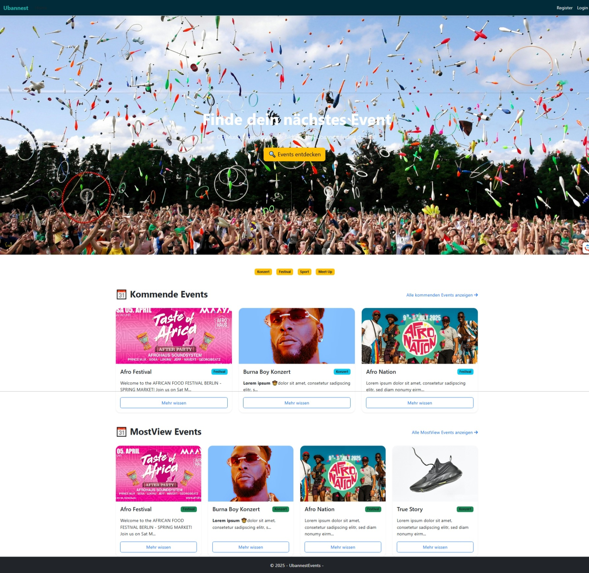
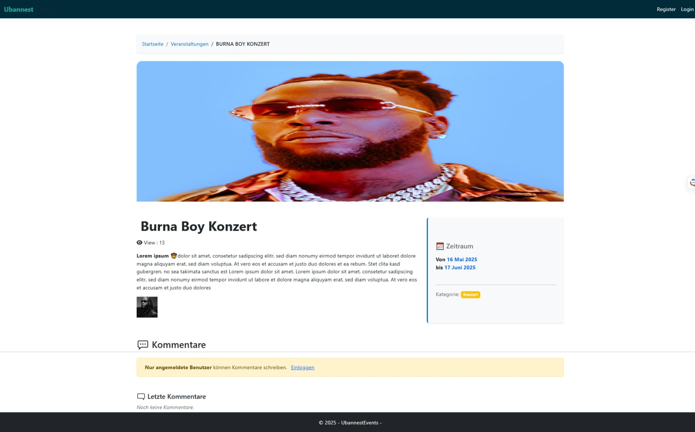
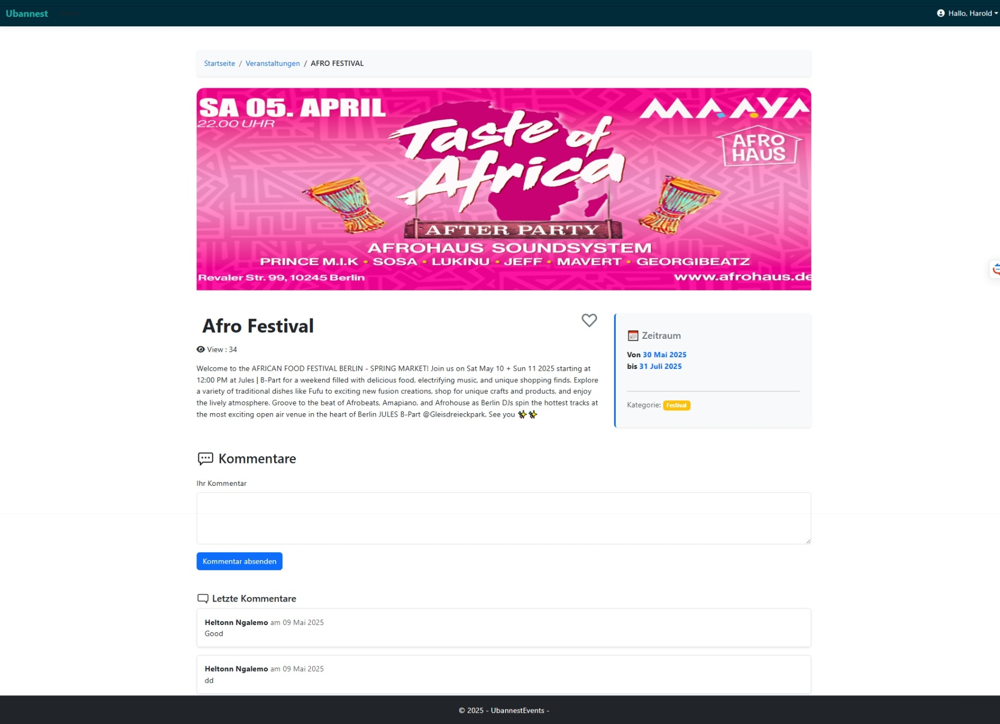
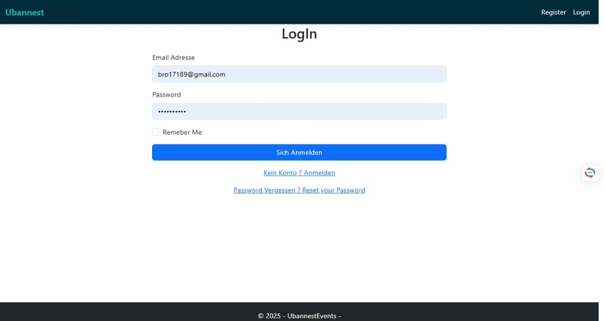
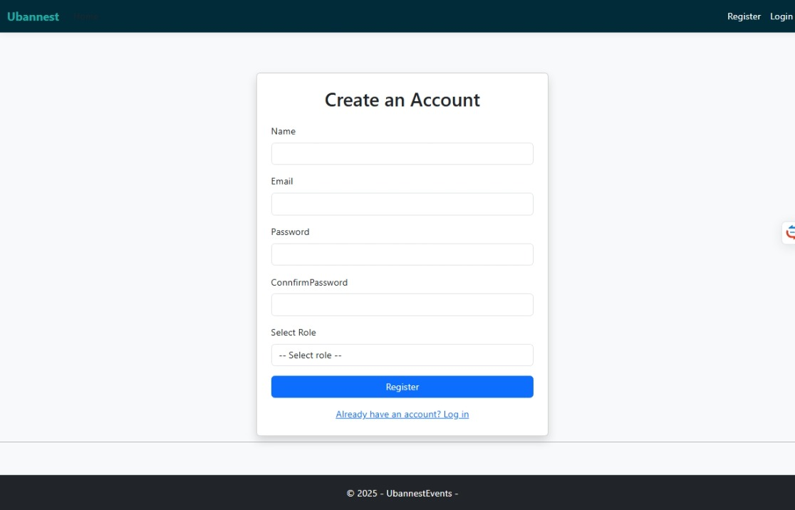
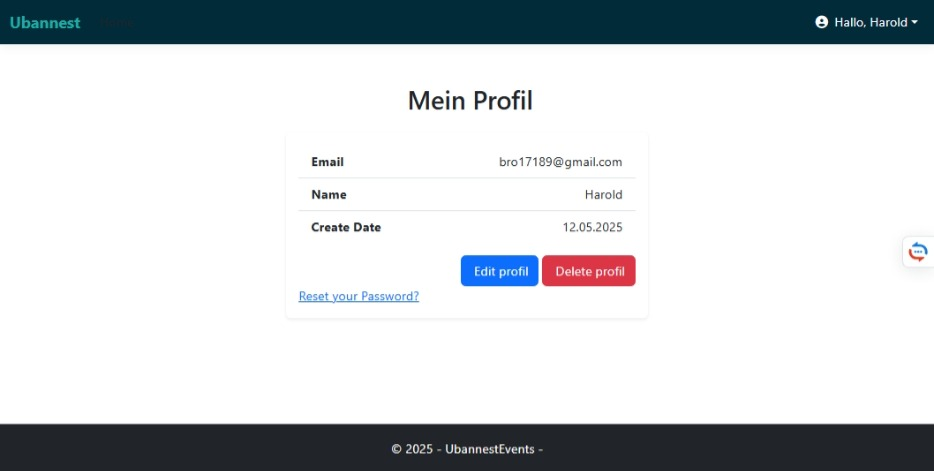
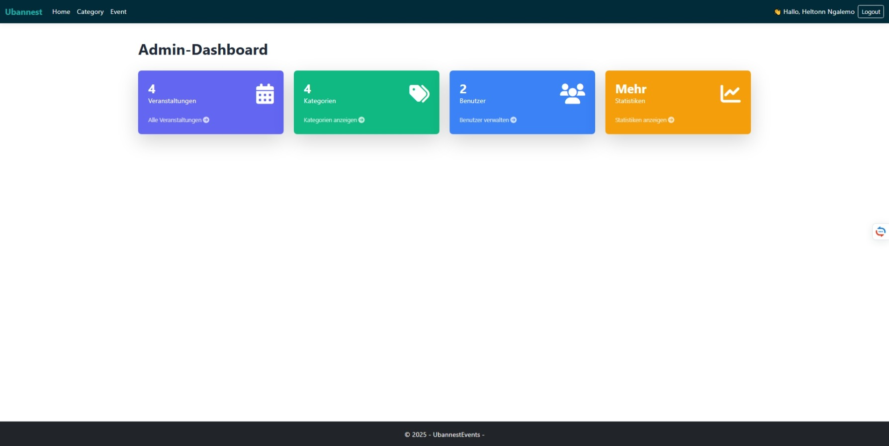
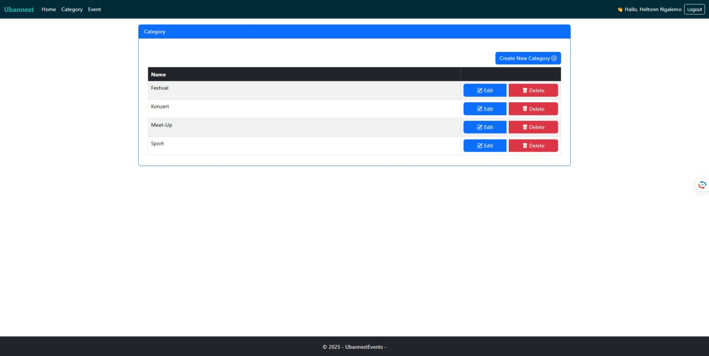
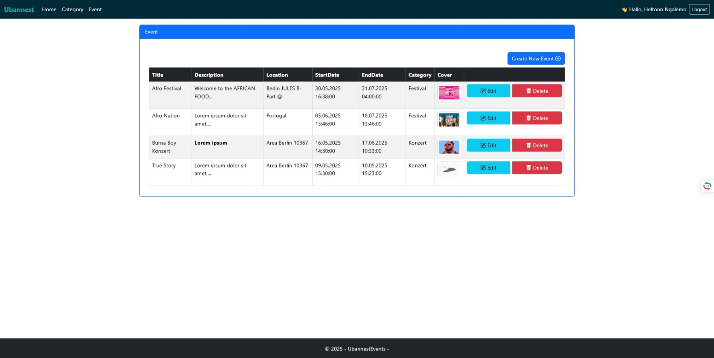

# Ubannest Events

Ubannest Events ist eine Webanwendung, mit der Benutzer Veranstaltungen entdecken, erstellen und sich dafür anmelden können.  
Das Projekt wurde mit ASP.NET Core MVC entwickelt und nutzt Identity für Authentifizierung und Autorisierung.

##  Funktionen

-  Dynamischer Hero-Bereich
-  Veranstaltungen von heute und kommenden Tagen
-  Meistgesehene Veranstaltungen
-  Besucherzähler pro Veranstaltung
-  Kommentarfunktion pro Event
-  Favoritenfunktion für Veranstaltungen
-  Benutzerprofil mit Bearbeitungsmöglichkeiten:
  -  Name ändern
  -  Passwort ändern
  -  E-Mail-Adresse ändern
-  Authentifizierung mit ASP.NET Identity (Admin / Benutzer)
- Bilder-Upload für jedes Event
-  Responsive Navigation & Benutzerfreundliches Design
-  Admin-Bereich zur Verwaltung von Kategorien & Events

---

##  Screenshots

###  Startseite (Öffentlicher Bereich)

###  Veranstaltungsdetails
- Öffentliche Ansicht:
  
- Authentifizierter Benutzer:
  

---

###  Authentifizierung (Benutzerbereich)

-  Login-Seite:
  

-  Registrierung (Register):
  

-  Benutzerprofil:
  

---

###  Admin-Bereich

- Übersicht:
  

- Kategorienverwaltung:
  

- Veranstaltungenverwaltung:
  

##  Technologien

- **Backend**: ASP.NET Core MVC
- **Datenbank**: Entity Framework Core + SQL Server / SQLite
- **Authentifizierung**: ASP.NET Identity
- **Frontend**: Razor Pages + Bootstrap 5

---
##  Lokale Installation

### Voraussetzungen

- [.NET SDK](https://dotnet.microsoft.com/en-us/download) (Version 8.0 )
- Visual Studio 2022 
- SQL Server Express 

